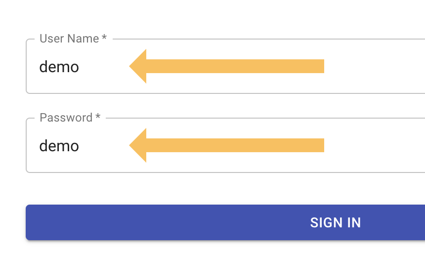
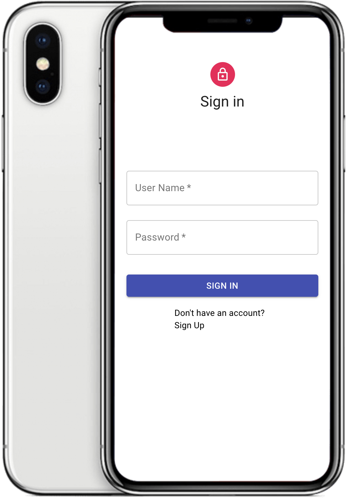
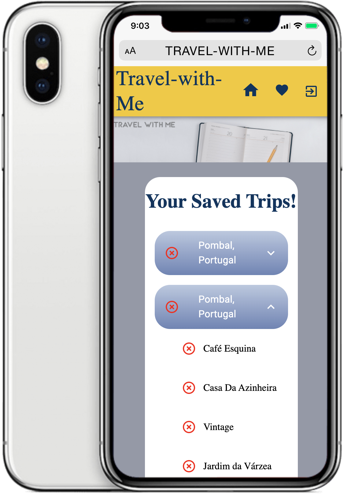
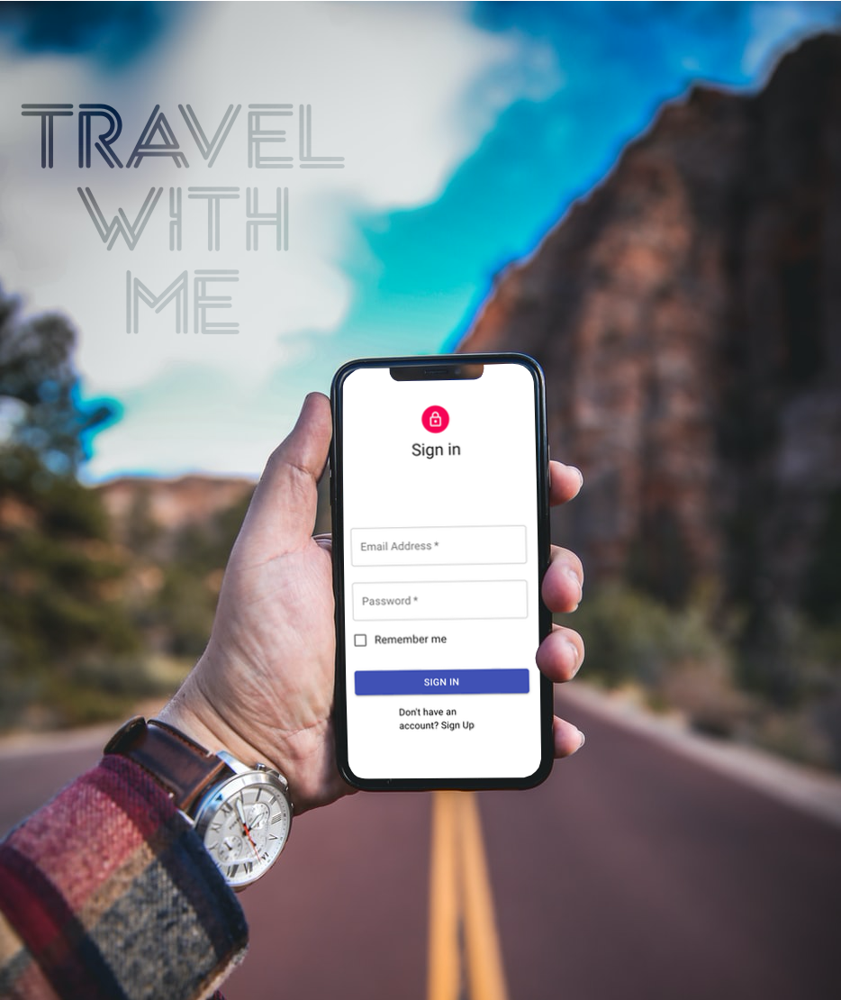

# Travel-With-Me 

  [](https://github.com)

## Table of Contents

  ## [Login](#login) &nbsp;&bull;&nbsp; [Description](#description) &nbsp;&bull;&nbsp; [Installation](#Installation) &nbsp;&bull;&nbsp; [Technologies](#technologies) &nbsp;&bull;&nbsp; [Developers](#developers) &nbsp;&bull;&nbsp; [Tests](#Tests) &nbsp;&bull;&nbsp; [Questions](#Questions)

## Login

**Username**: demo

**Password**: demo

<br />
<a href="http://travel-with-me.herokuapp.com"></a>

## Description

*Travel With Me* is a mobile application that allows users to discover cities around the world and save their destinations.


<br />

<br />

<br />

<br />

<br />


## Installation
  To install necessary dependencies, run the following command:
  ```
  npm i
  ```
  ```
  npm start
  ```

## Technologies
* React
* MongoDB / Mongoose
* AJAX
* Passport.js
* Bcrypt
* Material UI

## Developers
* <a href="https://github.com/cfech">Connor Fech</a>
* <a href="https://github.com/iamha1">Ha Nguyen</a>
* <a href="https://github.com/jbdunks">Jon Butler</a>
* <a href="https://github.com/waltribeiro">Walt Ribeiro</a>

## Tests
  To run tests, run the following command:
  ```
  npm test
  ```
## Questions

  If you have any questions about the repo, open an issue or contact us
