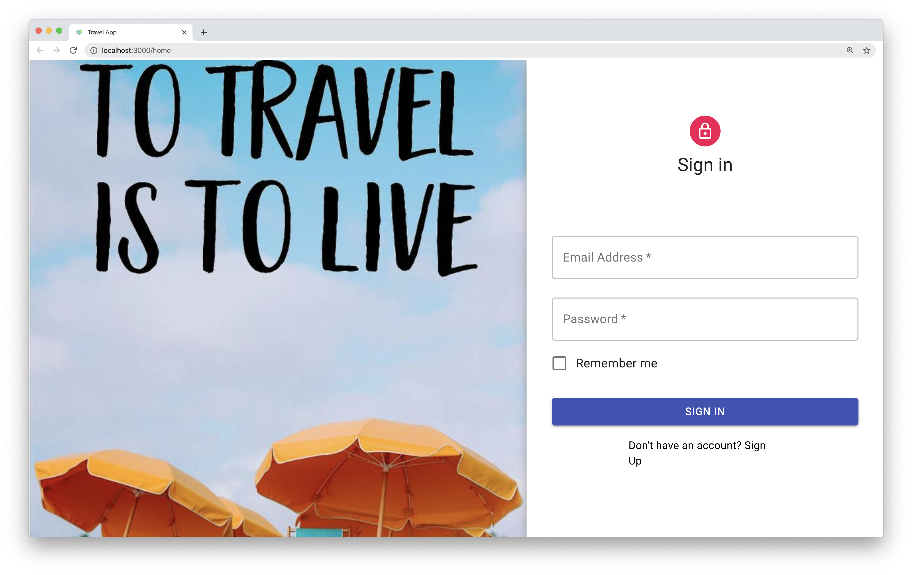
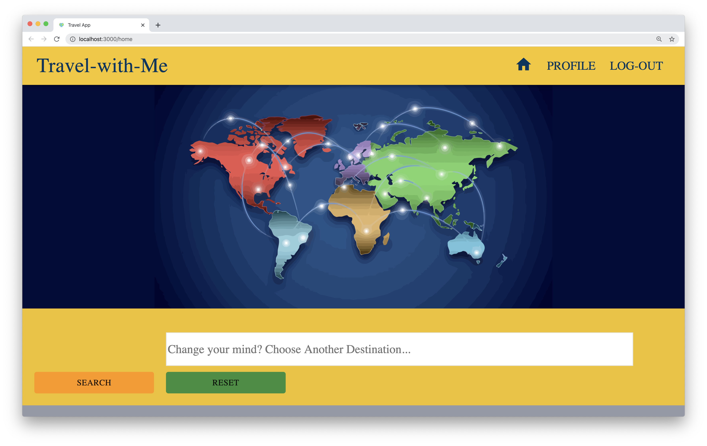

# Travel-With-Me 

  [](https://github.com)

## Table of Contents

  ## [Description](#description) &nbsp;&bull;&nbsp; [Installation](#Installation) &nbsp;&bull;&nbsp; [Usage](#Usage) &nbsp;&bull;&nbsp; [License](#License) &nbsp;&bull;&nbsp; [Technologies](#technologies) &nbsp;&bull;&nbsp; [Developers](#developers) &nbsp;&bull;&nbsp; [Tests](#Tests) &nbsp;&bull;&nbsp; [Questions](#Questions)
  
## Description

*Travel With Me* is a mobile application that allows users to discover cities around the world and save their destinations.
<br />

<br />

<br />

<br />

<br />

<br />


## Installation
  To install necessary dependencies, run the following command:
  ```
  npm i
  ```
  ```
  npm start
  ```

## Usage
  The end user may need a .env file with a session key for salt hashing.

## Technologies
* React
* MongoDB / Mongoose
* AJAX
* Passport.js
* Bcrypt
* Material UI

## License
TBA

## Developers
* <a href="https://github.com/cfech">Connor Fech</a>
* <a href="https://github.com/iamha1">Ha Nguyen</a>
* <a href="https://github.com/jbdunks">Jon Butler</a>
* <a href="https://github.com/waltribeiro">Walt Ribeiro</a>

## Tests
  To run tests, run the following command:
  ```
  npm test
  ```
## Questions

  If you have any questions about the repo, open an issue or contact us
